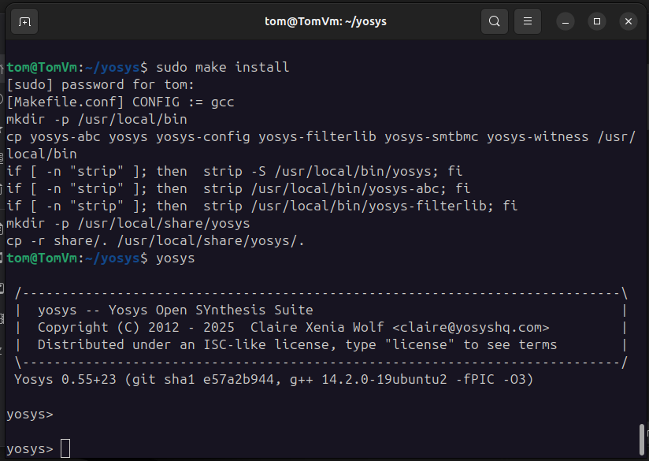
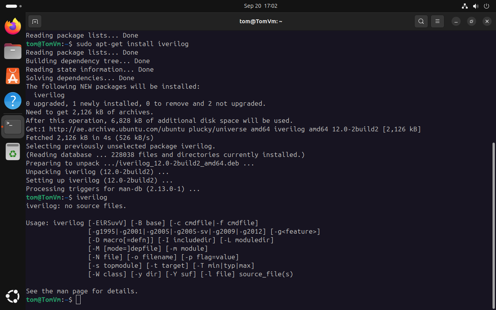
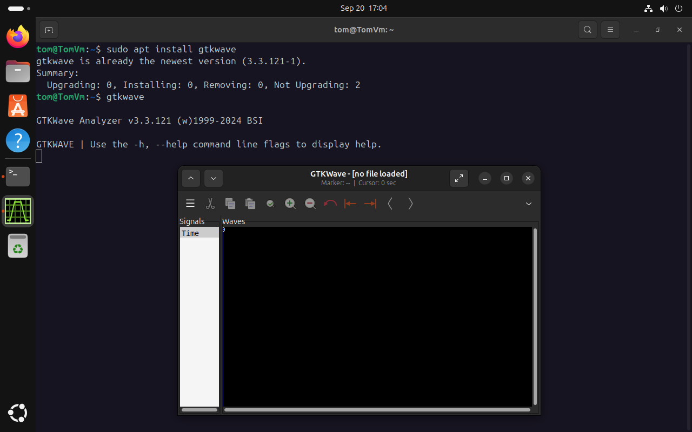
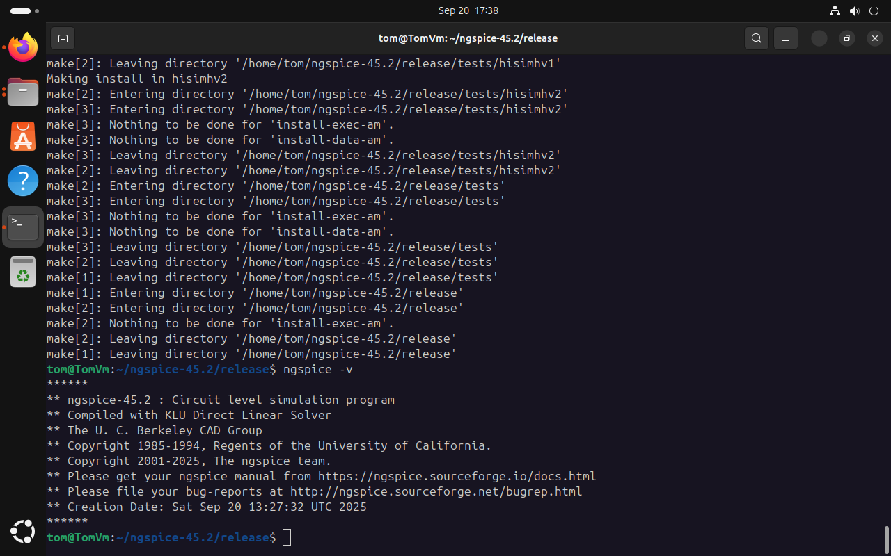
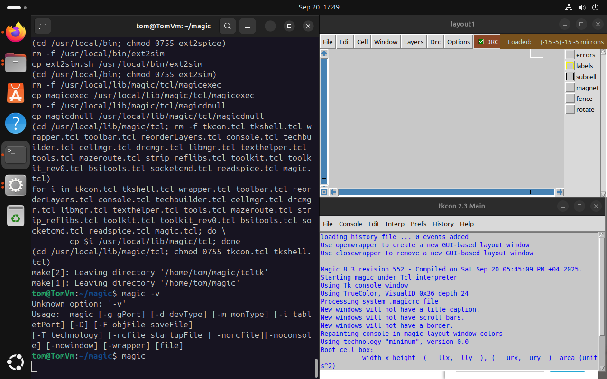
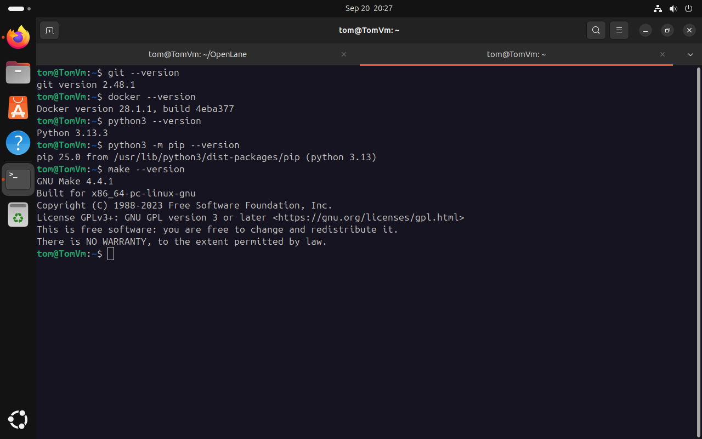

# My RISC-V Project Journal: Day 0 – Forging the Digital Anvil

## My Mission for Today

This document marks the beginning of my journey into the world of custom **RISC-V chip design**. Day 0 is all about **preparation**. My mission is to build a complete and robust **Electronic Design Automation (EDA) environment** from scratch. This digital workshop will be the foundation for everything that follows, from writing my first line of Verilog to generating the final GDSII file.

---

## The Workshop: My Virtual Machine Setup

For a project this complex, a clean and controlled environment is **non-negotiable**. I'm starting with a dedicated virtual machine using **Oracle VirtualBox**, which isolates all my tools and dependencies, ensuring a stable and reproducible setup.

### Virtual Machine Specifications:

-   **RAM:** 6 GB
-   **Hard Disk Space:** 50 GB
-   **Operating System:** Ubuntu 20.04
-   **CPU:** 4 virtual CPUs (vCPUs)

---

## Building My Digital Workshop: Tools of the Trade

Here, I'll document the installation of each open-source tool, explaining **what it is, why I need it, and how I'm installing it**.

### The Design & Verification Trio

These tools are for the **creative part of the process**: designing the logic and verifying its correctness.

#### 1. Yosys (The Synthesizer)

-   **What it is & why I need it:**
    Yosys is my digital translator. I'll write hardware designs in Verilog, and Yosys synthesizes this code into a **gate-level netlist**—a detailed map of logic gates and flip-flops that can be physically implemented.

-   **Installation:**
    ```bash
    sudo apt-get update
    git clone [https://github.com/YosysHQ/yosys.git](https://github.com/YosysHQ/yosys.git)
    cd yosys
    sudo apt-get install build-essential clang bison flex \
     libreadline-dev gawk tcl-dev libffi-dev git \
     graphviz xdot pkg-config python3 libboost-system-dev \
     libboost-python-dev libboost-filesystem-dev zlib1g-dev
    make config-gcc
    make
    sudo make install
    ```

-   **Proof of Success:**


#### 2. Icarus Verilog (The Simulator)

-   **What it is & why I need it:**
    Before synthesis, I need to ensure my design is logically correct. Icarus Verilog compiles and simulates my Verilog code against testbenches, allowing me to catch functional bugs early.

-   **Installation:**
    ```bash
    sudo apt-get update
    sudo apt-get install iverilog
    ```

-   **Proof of Success:** 


#### 3. GTKWave (The Waveform Viewer)

-   **What it is & why I need it:**
    GTKWave is my visual debugger. It converts simulation output (`.vcd` files) into graphical waveforms, so I can see exactly how signals behave over time.

-   **Installation:**
    ```bash
    sudo apt-get update
    sudo apt install gtkwave
    ```

-   **Proof of Success:** 


---

### The Physical & Analog Craftsmen

These tools help manage the physical and analog aspects of chip design.

#### 4. ngspice (The Circuit Simulator)

-   **What it is & why I need it:**
    Even digital circuits have underlying analog behavior. `ngspice` simulates these electrical characteristics, which is vital for verifying custom cells or analog blocks.

-   **Dependencies:**
    ```bash
    sudo apt-get install libxaw7-dev automake autoconf libtool
    ```

-   **Installation:**
    ```bash
    # Download the tarball from [https://sourceforge.net/projects/ngspice/files/](https://sourceforge.net/projects/ngspice/files/)
    tar -zxvf ngspice-*.tar.gz
    cd ngspice-*
    ./autogen.sh
    mkdir release
    cd release
    ../configure --with-x --with-readline=yes --disable-debug
    make
    sudo make install
    ```

-   **Proof of Success:** 


#### 5. Magic (The Layout Editor)

-   **What it is & why I need it:**
    Magic is where the digital design meets the physical world. I use it to view and edit the actual VLSI layout—the geometric polygons that define the transistors and interconnects on silicon.

-   **Dependencies:**
    ```bash
    sudo apt-get install m4 tcsh csh libx11-dev tcl-dev tk-dev \
     libcairo-dev mesa-common-dev libglu1-mesa-dev libncurses-dev
    ```

-   **Installation:**
    ```bash
    git clone [https://github.com/RTimothyEdwards/magic.git](https://github.com/RTimothyEdwards/magic.git)
    cd magic
    ./configure
    make
    sudo make install
    ```

-   **Proof of Success:** 


---

### The Master Production Line: OpenLane

OpenLane is the centerpiece of my automated flow, integrating all the individual tools into a powerful, cohesive system.

#### 6. OpenLane (Automated RTL-to-GDSII Flow)

-   **What it is & why I need it:**
    OpenLane automates the complex process of turning a synthesized netlist into a final physical layout (GDSII). It handles floorplanning, placement, routing, clock tree synthesis, and much more. It uses Docker to manage its complex dependencies in a self-contained environment.

-   **Docker Installation:**
    ```bash
    sudo apt-get update
    sudo apt-get upgrade
    sudo apt install -y build-essential python3 python3-venv python3-pip make git
    sudo apt install apt-transport-https ca-certificates curl software-properties-common
    curl -fsSL [https://download.docker.com/linux/ubuntu/gpg](https://download.docker.com/linux/ubuntu/gpg) | sudo gpg --dearmor -o /usr/share/keyrings/docker-archive-keyring.gpg
    echo "deb [arch=amd64 signed-by=/usr/share/keyrings/docker-archive-keyring.gpg] [https://download.docker.com/linux/ubuntu](https://download.docker.com/linux/ubuntu) $(lsb_release -cs) stable" | sudo tee /etc/apt/sources.list.d/docker.list > /dev/null
    sudo apt update
    sudo apt install docker-ce docker-ce-cli containerd.io
    sudo groupadd docker
    sudo usermod -aG docker $USER
    sudo reboot
    ```

#### 7. Dependency Verification

-   **Why I'm doing this:** Before building the full OpenLane environment, this quick check confirms that essential tools like `git`, `docker`, and `python` are installed and accessible, giving me confidence that the main installation will go smoothly.

-   **Verification Commands:**
    ```bash
    git --version
    docker --version
    python3 --version
    python3 -m pip --version
    make --version
    python3 -m venv -h
    ```

-   **Example Verification Output:**
    ```
    git version 2.48.1
    Docker version 28.1.1, build 4eba377
    Python 3.13.3
    pip 25.0 from /usr/lib/python3/dist-packages/pip (python 3.13)
    GNU Make 4.4.1
    ...
    ```


-   **OpenLane Installation (After Reboot):**
    ```bash
    cd $HOME
    git clone [https://github.com/The-OpenROAD-Project/OpenLane.git](https://github.com/The-OpenROAD-Project/OpenLane.git)
    cd OpenLane
    make       # This sets up the local software environment.
    make pdk   # This downloads and installs the required Process Design Kit (PDK).
    ```

---

## The Final Check: The "Hello, World!" of Chip Design

-   **Why I'm doing this:** This is my final sanity check. A successful test run confirms that all tools, libraries (PDKs), and dependencies are correctly installed and communicating with each other.

-   **Verification Command:**
    ```bash
    cd $HOME/OpenLane
    make test
    ```

By completing these Day 0 tasks, I now have a fully functional digital workshop ready for my RISC-V chip design journey. All tools, simulators, and automated flows are installed and verified—my digital anvil is forged.
