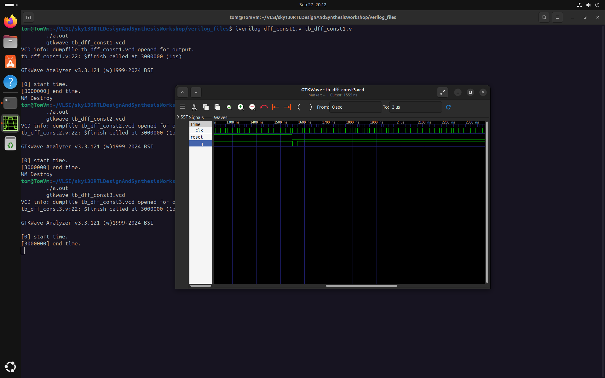
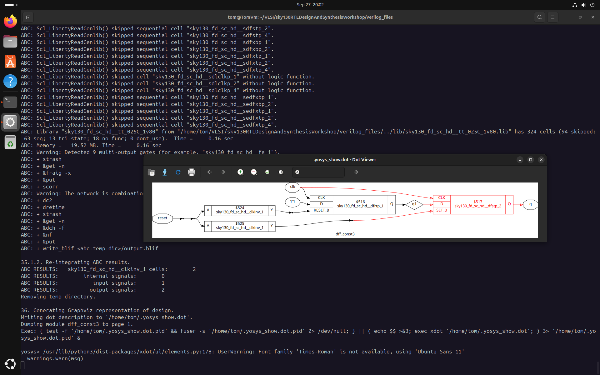

# My RISC-V Project Journal: Day 3 – The Art of Digital Sculpting

## Today's Focus: Logic Optimization

After learning how to translate Verilog into gates, today was about making that translation *smarter*. The goal of Day 3 was to explore **logic optimization**: the process of "sculpting" a synthesized netlist to make it smaller, faster, and more power-efficient without changing its fundamental function. A well-optimized design is the hallmark of a professional digital engineer, and today I learned the basic techniques that synthesis tools like Yosys use to achieve this.

### Combinational Logic Optimization: Less is More

The primary goal here is to simplify the combinational logic (the gates without memory) as much as possible.

* **Why do this?** A simpler circuit uses fewer transistors, which directly translates to a smaller chip area (lower cost) and lower power consumption. It can also make the circuit faster by reducing the number of gates a signal has to travel through.
* **How does it work?** The synthesizer uses a few clever tricks:
    1.  **Constant Propagation:** If an input to a logic gate is tied to a constant `1` or `0`, the synthesizer can often replace the gate with a simpler one or just a wire.
    2.  **Boolean Logic Optimization:** The tool uses classic digital logic theorems and methods to simplify complex boolean expressions into their most minimal form.
* **My Tool in Yosys:** The primary command for this is `opt_clean -purge`.

### Sequential Logic Optimization: A Smarter State

This type of optimization focuses on the memory elements of the design—the flip-flops.

* **Why do this?** Unnecessary flip-flops waste a significant amount of area and power. Sometimes, a design might have flops whose outputs are constant or unused, and the synthesizer can safely remove them.
* **How does it work?**
    * **Sequential Constant Propagation:** If a flop's input is tied to a constant, its output will also become constant after the first clock cycle. The synthesizer can often replace this flop with a direct connection to a `1` or `0`.
    * **Retiming:** A more advanced technique where the tool moves flops across combinational logic to better balance delays between pipeline stages, improving the overall clock speed.

### Hands-On Labs: Putting Optimization to the Test

I spent most of the day running experiments in Yosys to see these optimization techniques in action.

#### Combinational Optimization Labs

I created several small Verilog files (`opt_check.v`, `opt_check2.v`, etc.) with intentionally complex-looking logic to see how Yosys would simplify them.

* **Lab 1 (`opt_check.v`):** Tested a simple ternary operator. Yosys correctly reduced it to a single AND gate.
    ```bash
    yosys
    read_liberty -lib ../lib/sky130_fd_sc_hd__tt_025C_1v80.lib
    read_verilog opt_check.v 
    synth -top opt_check
    opt_clean -purge
    abc -liberty ../lib/sky130_fd_sc_hd__tt_025C_1v80.lib
    show
    ```
    
  
  
  
  
* **Lab 5 & 6 (Hierarchical Designs):** For designs with sub-modules (`multiple_module_opt.v`), I discovered a crucial two-step process. I had to first `flatten` the design to remove the module boundaries, which then allowed `opt_clean` to find optimization opportunities across the entire logic cone.
    ```bash
    # Phase 1: Flatten the design
    yosys
    read_liberty -lib ../lib/sky130_fd_sc_hd__tt_025C_1v80.lib
    read_verilog multiple_module_opt.v
    synth -top multiple_module_opt
    flatten
    write_verilog -noattr multiple_module_opt_flat.v
    
    # Phase 2: Optimize the flattened netlist
    yosys
    read_liberty -lib ../lib/sky130_fd_sc_hd__tt_025C_1v80.lib
    read_verilog multiple_module_opt_flat.v
    synth -top multiple_module_opt
    opt_clean -purge
    abc -liberty ../lib/sky130_fd_sc_hd__tt_025C_1v80.lib
    show
    ```
    
  [Alt](Day3/Comb2P2.png)
#### Sequential Optimization Labs

I then moved on to designs with D-Flip-Flops (DFFs) to see how the synthesizer handles constant inputs and unused outputs. For each, I first simulated the design to understand its expected behavior.

* **Lab 1 (`dff_const1.v`):** I designed a flop where the input `D` was tied to a constant `1`, but it had an asynchronous reset. The simulation showed that the reset correctly forces the output to 0. Because the output was not *truly* constant, Yosys correctly **preserved the flip-flop**.
    * **Simulation:**
        ```bash
        iverilog dff_const1.v tb_dff_const1.v
        ./a.out
        gtkwave tb_dff_const1.vcd
        ```
        
    * **Synthesis:**
        ```bash
        yosys
        read_liberty -lib ../lib/sky130_fd_sc_hd__tt_025C_1v80.lib
        read_verilog dff_const1.v
        synth -top dff_const1
        dfflibmap -liberty ../lib/sky130_fd_sc_hd__tt_025C_1v80.lib
        abc -liberty ../lib/sky130_fd_sc_hd__tt_025C_1v80.lib
        show
        ```
        

* **Lab 2 (`dff_const2.v`):** In this case, the flop's output was always `1`, regardless of the clock or reset. The synthesizer was smart enough to recognize this and **optimized the flop away completely**, replacing it with a direct connection to a logic `1`.
    * **Simulation:**
        ```bash
        iverilog dff_const2.v tb_dff_const2.v
        ./a.out
        gtkwave tb_dff_const2.vcd
        ```
        
    * **Synthesis:**
        ```bash
        yosys
        read_liberty -lib ../lib/sky130_fd_sc_hd__tt_025C_1v80.lib
        read_verilog dff_const2.v
        synth -top dff_const2
        dfflibmap -liberty ../lib/sky130_fd_sc_hd__tt_025C_1v80.lib
        abc -liberty ../lib/sky130_fd_sc_hd__tt_025C_1v80.lib
        show
        ```
        
* **Lab 3 (`dff_const3.v`):** This lab involved two flip-flops in series. The simulation showed the classic one-cycle delay pipeline. Because of this dependency, Yosys correctly **retained both flip-flops**.
    * **Simulation:**
        ```bash
        iverilog dff_const3.v tb_dff_const3.v
        ./a.out
        gtkwave tb_dff_const3.vcd
        ```
        
    * **Synthesis:**
        ```bash
        yosys
        read_liberty -lib ../lib/sky130_fd_sc_hd__tt_025C_1v80.lib
        read_verilog dff_const3.v
        synth -top dff_const3
        dfflibmap -liberty ../lib/sky130_fd_sc_hd__tt_025C_1v80.lib
        abc -liberty ../lib/sky130_fd_sc_hd__tt_025C_1v80.lib
        show
        ```
        
      
* **Lab 6 (`counter_opt.v`):** This was the most impressive optimization. I designed a 3-bit counter but only used the least significant bit (`count[0]`). By running `opt_clean -purge`, Yosys recognized that two flops were unused and **removed them**, leaving only a single toggle-flop.
    * **Simulation:**
        ```bash
        iverilog counter_opt.v tb_counter_opt.v
        ./a.out
        gtkwave tb_counter_opt.vcd
        ```
       
    * **Synthesis:**
        ```bash
        yosys
        read_liberty -lib ../lib/sky130_fd_sc_hd__tt_025C_1v80.lib
        read_verilog counter_opt.v
        synth -top counter_opt
        dfflibmap -liberty ../lib/sky130_fd_sc_hd__tt_025C_1v80.lib
        opt_clean -purge  # The crucial step
        abc -liberty ../lib/sky130_fd_sc_hd__tt_025C_1v80.lib
        show
        ```
        


        **👉 End of Day 3.** 
