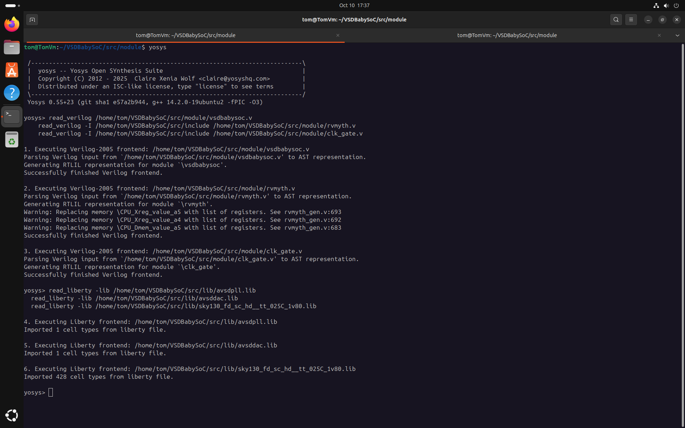
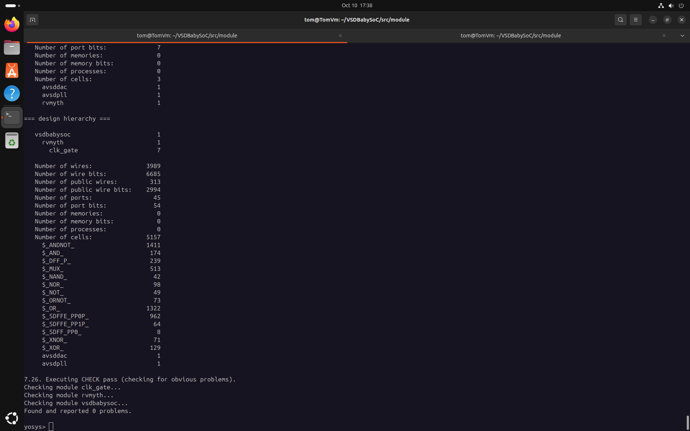
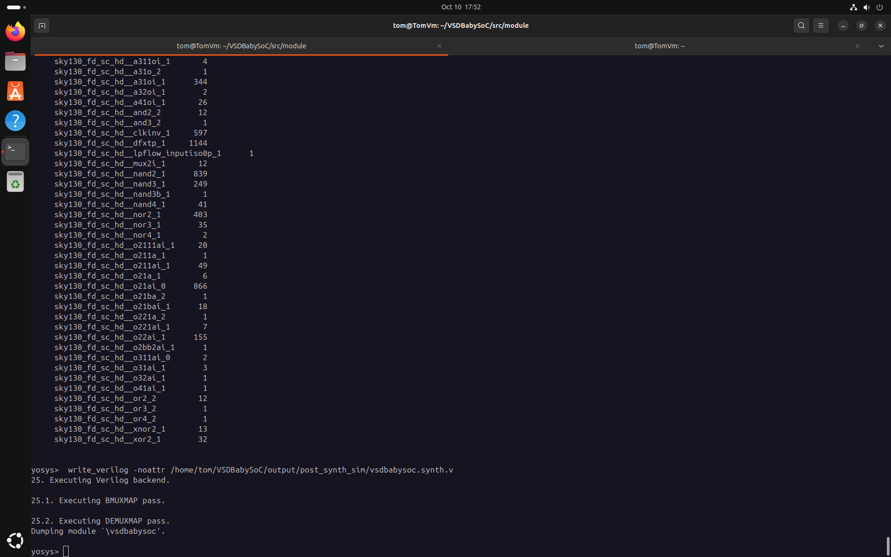
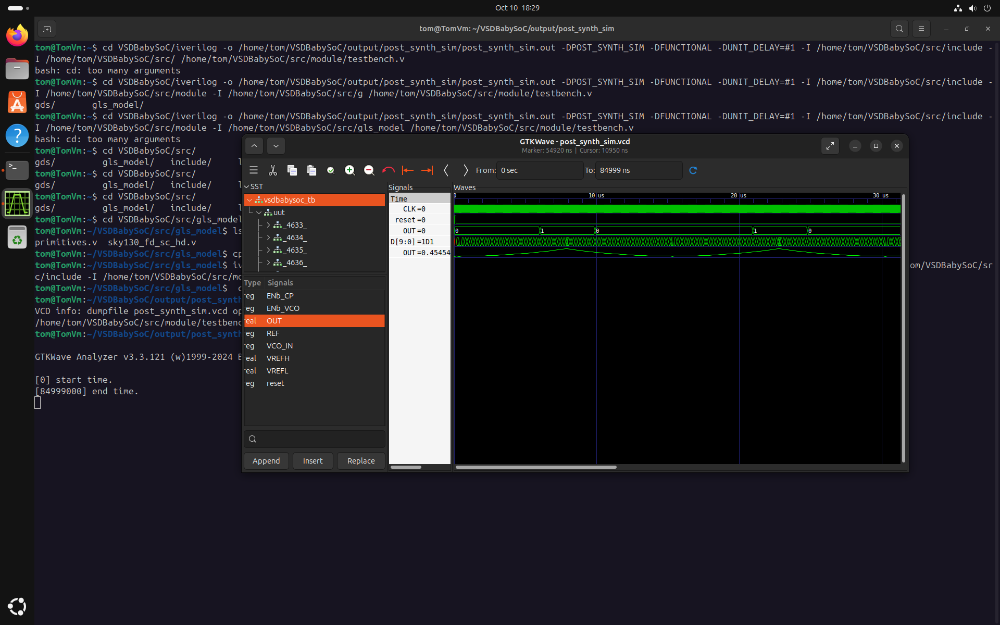

# Week 3 Task – Post-Synthesis GLS Fundamentals

## Objective

Understand and perform Gate-Level Simulation (GLS) after synthesis to validate design functionality.

---

## Part 1 – Post-Synthesis Gate-Level Simulation (GLS)

> GLS checks your synthesized design at the gate level for functional correctness and timing.

### What is GLS?

- **Gate-Level Simulation** verifies your design after synthesis using the gate-level netlist.
- Ensures the synthesized implementation matches RTL simulation.
- Incorporates timing delays for realistic validation.

---

### Step-by-Step GLS Flow

#### 1. Synthesize BabySoC Design

- Load top-level and supporting modules in Yosys:
  ```yosys
  read_verilog /home/tom/VSDBabySoC/src/module/vsdbabysoc.v
    read_verilog -I /home/tom/VSDBabySoC/src/include /home/tom/VSDBabySoC/src/module/rvmyth.v
    read_verilog -I /home/tom/VSDBabySoC/src/include /home/tom/VSDBabySoC/src/module/clk_gate.v
  ```
  
- Load Liberty files:
  ```yosys
  read_liberty -lib /home/tom/VSDBabySoC/src/lib/avsdpll.lib
  read_liberty -lib /home/tom/VSDBabySoC/src/lib/avsddac.lib
  read_liberty -lib /home/tom/VSDBabySoC/src/lib/sky130_fd_sc_hd__tt_025C_1v80.lib
  ```
   
- Synthesize and optimize:
  ```yosys
  synth -top vsdbabysoc
  dfflibmap -liberty /home/tom/VSDBabySoC/src/lib/sky130_fd_sc_hd__tt_025C_1v80.lib
  opt
  abc -liberty /home/tom/VSDBabySoC/src/lib/sky130_fd_sc_hd__tt_025C_1v80.lib -script +strash;scorr;ifraig;retime;{D};strash;dch,-f;map,-M,1,{D}
  flatten
  setundef -zero
  clean -purge
  rename -enumerate
  stat
  write_verilog -noattr /home/tom/VSDBabySoC/output/post_synth_sim/vsdbabysoc.synth.v
  ```
   

#### 2. Run Gate-Level Simulation

- Compile the testbench with Icarus Verilog:
  ```bash
  iverilog -o /home/tom/VSDBabySoC/output/post_synth_sim/post_synth_sim.out -DPOST_SYNTH_SIM -DFUNCTIONAL -DUNIT_DELAY=#1 -I /home/tom/VSDBabySoC/src/include -I /home/tom/VSDBabySoC/src/module /home/tom/VSDBabySoC/src/module/testbench.v
  ```
- Run simulation and view waveforms:
  ```bash
  cd /home/tom/VSDBabySoC/output/post_synth_sim/
  ./post_synth_sim.out
  gtkwave post_synth_sim.vcd
  ```
   
---

## References

- [GLS Example – VSD_HDP Day 6](https://github.com/Ananya-KM/VSD_HDP/blob/main/Day%206.md)
- [BabySoC Design](https://github.com/Ananya-KM/VSD_HDP)


---
